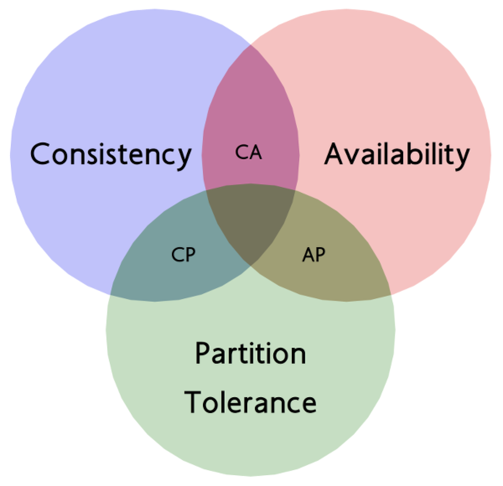
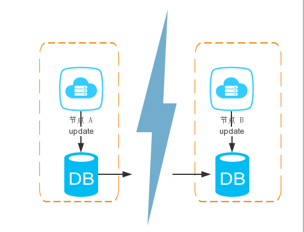
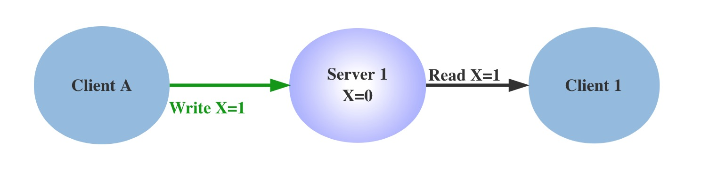
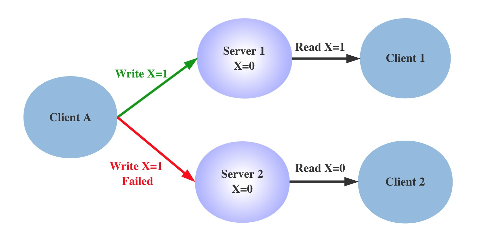

## CAP定理 代表什么含义
2000 年的时候，Eric Brewer 教授提出了 CAP 猜想，2年后，被 Seth Gilbert 和 Nancy Lynch 从理论上证明了猜想的可能性，从此，CAP 理论正式在学术上成为了分布式计算领域的公认定理。并深深的影响了分布式计算的发展。

CAP 理论告诉我们，一个分布式系统不可能同时满足一致性（C:Consistency)，可用性（A: Availability）和分区容错性（P：Partition tolerance）这三个基本需求，最多只能同时满足其中的2个。

<div style="padding-left:30%"></div>

- `一致性（C）`是指“所有节点同时看到相同的数据”，即更新操作成功并返回客户端完成后，所有节点在同一时间的数据完全一致，等同于所有节点拥有数据的最新版本。

- `可用性（A）`是指“任何时候，读写都是成功的”，即服务一直可用，而且是正常响应时间。我们平时会看到一些IT公司的对外宣传，比如系统稳定性已经做到3个9、4个9，即99.9%、99.99%，这里的 N 个 9 就是对可用性的一个描述，叫做 SLA，即服务水平协议。比如我们说月度 99.95% 的 SLA，则意味着每个月服务出现故障的时间只能占总时间的 0.05%，如果这个月是 30 天，那么就是 21.6 分钟。

- `分区容忍性（P）`具体是指“当部分节点出现消息丢失或者分区故障的时候，分布式系统仍然能够继续运行”，即系统容忍网络出现分区，并且在遇到某节点或网络分区之间网络不可达的情况下，仍然能够对外提供满足一致性和可用性的服务，除非整个网络环境都发生了故障。


``` markdown
什么是分区？
在分布式系统中，不同的节点分布在不同的子网络中，由于一些特殊的原因，这些子节点之间出现了网络不通的状态，但他们的内部子网络是正常的。
从而导致了整个系统的环境被切分成了若干个孤立的区域。这就是分区。
```
在分布式系统中，由于系统的各层拆分，P 是确定的，CAP 的应用模型就是 CP 架构和 AP 架构。分布式系统所关注的，就是在 Partition Tolerance 的前提下，如何实现更好的 A，和更稳定的 C。

## 为什么只能 3 选 2

首先问，能不能同时满足这三个条件？
假设有一个系统如下：
<div style="padding-left:20%"></div>

<br>整个系统由两个节点配合组成，之间通过网络通信，当节点 A 进行更新数据库操作的时候，需要同时更新节点 B 的数据库（这是一个原子的操作）。
<br>上面这个系统怎么满足 CAP 呢？C：当节点A更新的时候，节点B也要更新，A：必须保证两个节点都是可用的，P：当节点 A,B 出现了网络分区，必须保证对外可用。
<br>可见，根本完成不了，只要出现了网络分区，A 就无法满足，因为节点 A 根本连接不上节点 B。如果强行满足 C 原子性，就必须停止服务运行，从而放弃可用性 C。
所以，最多满足两个条件：

 - `CA`满足原子和可用，放弃分区容错。说白了，就是一个整体的应用。

 - `CP`满足原子和分区容错，也就是说，要放弃可用。当系统被分区，为了保证原子性，必须放弃可用性，让服务停用。
 
 - `AP`满足可用性和分区容错，当出现分区，同时为了保证可用性，必须让节点继续对外服务，这样必然导致失去原子性。

## CAP 理论的证明
CAP 理论的证明有多种方式，通过反证的方式是最直观的。反证法来证明 CAP 定理，最早是由 Lynch 提出的，通过一个实际场景，
如果 CAP 三者可同时满足，由于允许 P 的存在，则一定存在 Server 之间的丢包，如此则不能保证 C。

<div style="padding-left:20%"></div>

首先构造一个单机系统，如上图，Client A 可以发送指令到 Server 并且设置更新 X 的值，Client 1 从 Server 读取该值，在单点情况下，即没有网络分区的情况下，通过简单的事务机制，可以保证 Client 1 读到的始终是最新值，不存在一致性的问题。

<div style="padding-left:20%"></div>

我们在系统中增加一组节点，因为允许分区容错，Write 操作可能在 Server 1 上成功，在 Server 2 上失败，这时候对于 Client 1 和 Client 2，就会读取到不一致的值，出现不一致的情况。如果要保持 X 值的一致性，Write 操作必须同时失败， 也就是降低系统的可用性。

可以看到，在分布式系统中，无法同时满足 CAP 定律中的“一致性”、“可用性”和“分区容错性”三者。

在该证明中，对 CAP 的定义进行了更明确的声明：

- `Consistency`，一致性被称为原子对象，任何的读写都应该看起来是“原子“的，或串行的，写后面的读一定能读到前面写的内容，所有的读写请求都好像被全局排序;

- `Availability`，对任何非失败节点都应该在有限时间内给出请求的回应（请求的可终止性）；

- `Partition Tolerance`，允许节点之间丢失任意多的消息，当网络分区发生时，节点之间的消息可能会完全丢失。

## 能不能解决 3 选 2 的问题
难道真的没有办法解决这个问题吗？

CAP 理论已经提出了 13 年，也许可以做些改变。

仔细想想，分区是百分之百出现的吗？如果不出现分区，那么就能够同时满足 CAP。如果出现了分区，可以根据策略进行调整。比如 C 不必使用那么强的一致性，可以先将数据存起来，稍后再更新，实现所谓的 “最终一致性”。

这个思路又是一个庞大的问题，同时也引出了第二个理论 Base 理论，我们将在后面的文章中详细介绍。


## CAP 理论的应用

CAP 理论提醒我们，在架构设计中，不要把精力浪费在如何设计能满足三者的完美分布式系统上，而要合理进行取舍，CAP 理论类似数学上的不可能三角，只能三者选其二，不能全部获得。

不同业务对于一致性的要求是不同的。举个例来讲，在微博上发表评论和点赞，用户对不一致是不敏感的，可以容忍相对较长时间的不一致，只要做好本地的交互，并不会影响用户体验；而我们在电商购物时，产品价格数据则是要求强一致性的，如果商家更改价格不能实时生效，则会对交易成功率有非常大的影响。

需要注意的是，CAP理论中是忽略网络延迟的，也就是当事务提交时，节点间的数据复制一定是需要花费时间的。即使是同一个机房，从节点A复制到节点B，由于现实中网络不是实时的，所以总会有一定的时间不一致。


